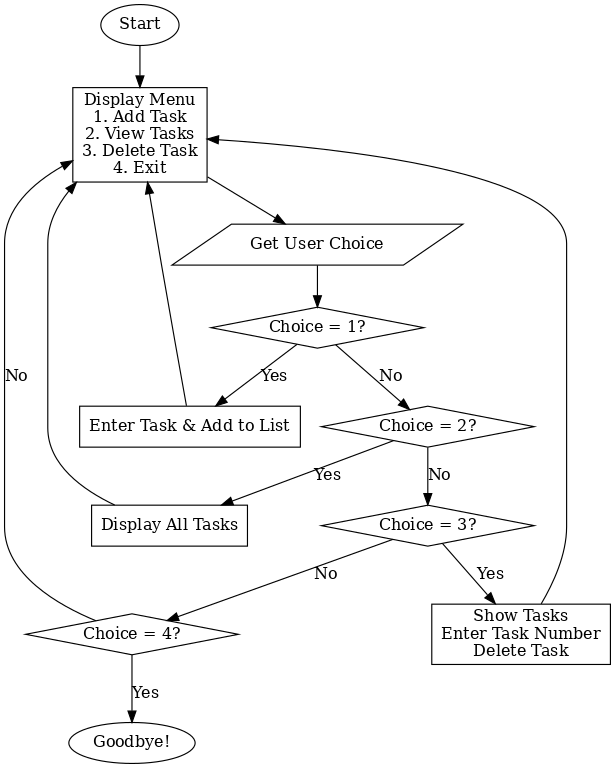

# To-Do List Program

## Students:
- NAWAF IBRAHIM SALEH ALWABEL
- KHALID ABDULLAH MOHAMMED ALFAWAZ
- ZIYAD ABDULLAH ABDULAZIZ ALAJLAN
- ABDULLAH SAAD ABDULLAH BINHAZZA

---

## A. Describe for the program
This project is a simple **To-Do List program**.  
The user can add tasks, view all tasks, and delete tasks.  

The program shows a menu with four options:
1. Add a task  
2. View all tasks  
3. Delete a task  
4. Exit the program  

The user can choose what to do by typing a number.  
The program repeats until the user chooses to exit.  
It is easy to use and helps the user to organize tasks.  

---

## B. Algorithm for programming
1. **Start**  
2. Display the menu with options:  
   - (1) Add Task  
   - (2) View All Tasks  
   - (3) Delete Task  
   - (4) Exit  
3. Ask the user to enter a choice.  
4. If the choice is **1**:  
   - Ask the user to enter a task.  
   - Add the task to the list.  
   - Go back to step 2.  
5. If the choice is **2**:  
   - Display all tasks from the list.  
   - Go back to step 2.  
6. If the choice is **3**:  
   - Display all tasks with numbers.  
   - Ask the user to enter the number of the task to delete.  
   - Delete the selected task from the list.  
   - Go back to step 2.  
7. If the choice is **4**:  
   - Display "Goodbye!".  
   - End the program.  
8. If the user enters an invalid choice:  
   - Show error message.  
   - Go back to step 2.  

---

## C. Flowchart for Algorithm

---

## D. Program in Python
The code is available in the file: **[`todo.py`](todo.py)**
